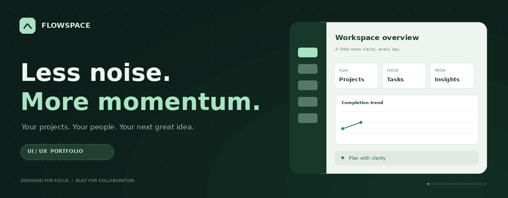

<div align="center">



# A calmer way to get things done.

**FlowSpace brings projects, tasks, people, and plans into one thoughtful workspace.**

A responsive UI/UX portfolio project with a working Python backend, email-verification flows, a real calendar, and live task analytics.

**HTML · CSS · JavaScript · Python · SQLite**

[Explore the features](#-one-workspace-eight-views) &nbsp; · &nbsp; [Run locally](#-get-started) &nbsp; · &nbsp; [Account verification](#-account-verification) &nbsp; · &nbsp; [Design details](#-designed-around-the-details)

</div>

---

## ✦ The idea

Work feels easier when the interface gives you clarity. FlowSpace combines a calm visual system with useful interactions: readable project cards, a task board you can move through, an actionable calendar, and analytics that reflect the work you actually save.

The focus is on the complete experience—from opening the login screen to creating a project, completing a task, and seeing that progress appear in a chart.

> **Portfolio preview:** The animated banner is a stylised illustration. The application itself runs locally using the instructions below. A public demo URL can be added after deployment.

## ◈ One workspace. Eight views.

| View | What you can do |
| :--- | :--- |
| **Overview** | See live workspace metrics, active projects, personal tasks, and recent activity. |
| **Projects** | Create, edit, delete, favorite, and filter projects. View completion based on linked tasks. |
| **My Tasks** | Assign tasks, set priorities and deadlines, link projects, and move work across four statuses. |
| **Analytics** | Explore 7- or 30-day completion trends, a task-status pie chart, priority/member bar charts, and CSV exports. |
| **Messages** | Use shared workspace chat with saved history and five-second polling. |
| **Team** | Invite new accounts, view members, and manage access as the workspace owner. |
| **Calendar** | Navigate real months, select dates, manage timed events, and see project/task deadlines. |
| **Settings** | Update your profile, mobile number, workspace name, theme, password, and recovery questions. |

Each view has its own HTML page and URL. Browser refresh and back/forward navigation work naturally.

## ✧ Designed around the details

<table>
<tr>
<td width="50%" valign="top">

### Calm visual language

Dark green navigation, warm neutral surfaces, restrained accents, readable typography, and consistent spacing.

### Light & dark themes

Switch themes on authentication screens or in the app header. Browser preferences load before paint; signed-in theme changes are saved to the account.

### Responsive by design

Layouts adapt from mobile screens to larger desktops, with touch-friendly controls and form text sized for mobile use.

</td>
<td width="50%" valign="top">

### Motion with purpose

Branded startup loading, request progress, submit spinners, subtle entry animations, and modal transitions. Reduced-motion preferences are respected.

### Clear interaction feedback

Visible focus states, input errors, dismissible notifications, and keyboard focus restoration after content updates.

### Multiple ways to interact

Drag tasks between columns or use status dropdowns. Explore chart tooltips, readable legends, and the completion chart’s data table.

</td>
</tr>
</table>

## ▶ Get started

**You need Python 3.10 or newer.** No third-party Python packages, npm installation, Docker, or frontend build step is required.

Download this repository as a ZIP, extract it, and open Terminal in the folder containing `server.py`.

### macOS / Linux

```bash
# Enable the explicit local UI/UX demo configuration.
cp .env.example .env

# Start FlowSpace.
python3 server.py
```

### Windows PowerShell

```powershell
Copy-Item .env.example .env
python server.py
```

Open **http://127.0.0.1:8000** in your browser. Create an account, supply a mobile number with country code and two recovery answers, then enter the code displayed in the demo panel.

> **UI/UX demo mode**  
> Test codes appear on screen. No real email is sent. Demo mode previews the verification experience; it does not verify ownership of a real mailbox.

Keep Terminal running while using the app. Press **Control+C** to stop it. Open the app through its server address rather than double-clicking `index.html`.

<details>
<summary><strong>Port already in use?</strong></summary>

On macOS / Linux:

```bash
PORT=8002 python3 server.py
```

On Windows PowerShell:

```powershell
$env:PORT = "8002"
python server.py
```

Then open **http://127.0.0.1:8002**. An older server can be stopped with Control+C in the Terminal where it is running.

</details>

<details>
<summary><strong>Trying messages with two accounts?</strong></summary>

1. Sign in as the workspace owner.
2. Open **Team → Invite member** and enter an email that has not registered yet.
3. Open the app in an incognito/private browser window.
4. Register using exactly that invited email and complete verification.
5. Open **Messages** in both sessions and send a message.

The invited account joins the same workspace. Messages update every five seconds. Invitations are recorded in the app; no invitation email is sent automatically. This version supports one workspace per account.

</details>

## ◇ Account verification

| Flow | Behavior |
| :--- | :--- |
| **Signup** | The account is created only after its email OTP is verified. |
| **Repeat login** | After the 24-hour verification window, the correct password must be followed by a new email OTP. |
| **Password recovery** | Verify the email OTP, answer the configured security questions, and choose a new password. Previous sessions are revoked. |
| **OTP controls** | Six-digit codes, ten-minute expiry, five-attempt limit, single-use verification, resend cooldown, and request throttling. |
| **Mobile number** | Collected at signup, stored in international format, and editable in Settings. SMS verification is not implemented. |

Passwords and security answers are stored as salted hashes. Sessions use HttpOnly cookies, authenticated mutations require CSRF tokens, and workspace operations check membership.

**For actual email delivery:** set `FLOWSPACE_DEMO_MAIL=0` and configure your SMTP provider on the server. See [EMAIL_SETUP.md](EMAIL_SETUP.md). Without SMTP configuration or explicit demo mode, OTP-dependent access remains blocked.

Security answers supplement email OTP; they do not independently authorize password recovery. Older accounts without recovery questions can recover with a verified email code until questions are added in Settings.

## ⚙ Built with

| Layer | Technology | Why it fits |
| :--- | :--- | :--- |
| Interface | HTML, CSS, vanilla JavaScript | Direct control over layout, motion, and interaction states. |
| Charts | SVG | Data-driven graphs and pie charts without chart-library downloads. |
| Server | Python standard library | A small backend with no package-install step. |
| Storage | SQLite | Saved accounts, projects, tasks, events, messages, and workspace membership. |
| Verification | SMTP / explicit demo mode | Real email delivery when configured; transparent test codes for portfolio previews. |

## ✓ Validation

Run the included integration checks:

```bash
python3 test_server.py
python3 test_auth.py
```

They use temporary databases and cover authentication, OTP expiry/reuse, recovery, access controls, saved operations, mobile-number validation, theme preferences, and logout.

Frontend renderer checks were also completed for the eight views, calendar date logic, charts, OTP/recovery screens, loading cleanup, and escaped content. **Full visual browser QA and live SMTP delivery have not been verified in the development environment.**

## ☁ Deployment & data

The app needs a Python web service. Static hosting alone cannot run its API.

- Set `FLOWSPACE_HOST=0.0.0.0` for external HTTP access.
- Enable `FLOWSPACE_SECURE_COOKIE=1` when hosted behind HTTPS.
- Configure demo mode or an email provider using server environment variables.
- Keep `flowspace.db` on persistent storage if accounts and work must survive service restarts.

SQLite data lives in `flowspace.db` beside `server.py` by default. To back up locally, stop the server and copy this file. When upgrading, retain your database and `.env`; schema updates run automatically.

**Keep these private:** `.env`, database files, SMTP credentials, and user data. Upload `.env.example` as the configuration template. Public production use requires further operational review and an appropriate production hosting setup.

---

<div align="center">

### Less noise. More momentum.

**A UI/UX portfolio project by Sakravarthi Prabu**

Explore the interface. Follow the interactions. Make the workspace your own.

[Back to top ↑](#a-calmer-way-to-get-things-done)

</div>
